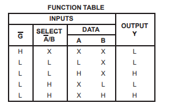
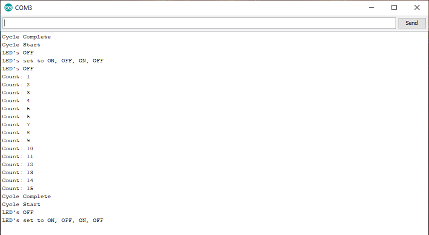
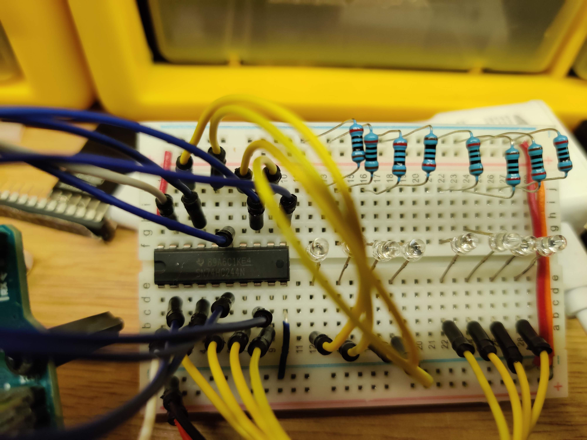
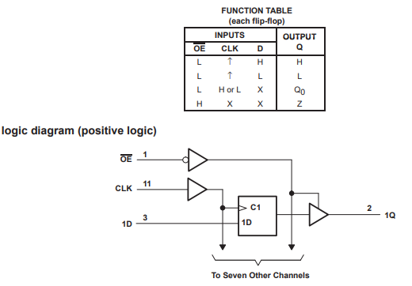

# 74HCXXX Series Integrated Circuits (IC's)
  This will serve as documentation and, a quick lookup for myself of IC's that i've investigated.  Adding other series as I investigate new circuits.

### 74HC00 High Speed CMOS Logic Quad 2-Input NAND Gates

- Description - The SN54HC00 and SN74HC00 devices contain four independent, 2-input NAND gates. They perform the Boolean function Y = A × B or Y = A + B in positive logic.
- [74HC00 Data Sheet](http://www.ti.com/lit/ds/symlink/sn74hc00.pdf)
- 74HC00 Wiring  

**Type**|**Arduino Pin**|**IC pin**
-----:|:-----:|:-----:
input 1| 2 | 1
input 2| 3| 2
output 1| XX | 3
input 3| 4| 4
input 4| 5| 5
output 2| XX | 6
Gnd| Gnd | 7
output 3| XX | 8
input 5| 6| 9
input 6| 7| 10
output 4 | XX | 11
input 7| 8| 12
input 8| 9| 13
VCC | 5V | 14

- [74HC00 Simple Test Code](74HC00/74HC00.ino)  
- Images/Info
  -  - using a 8 pin switch  
  -  - using 8 pins on an arduino
  -  - screenshot of serial output
- Materials
  - Arduino, LEDs (red), resistors (220)
- Notes - tested first with 8 pin switch, and then tested it with the arduino.  resistors go from LED to ground.
  
### 74HC02 High Speed CMOS Logic Quad 2-Input NOR Gates

- Description - The SNx4HC02 devices contain four independent 2-input NOR gates. They perform the Boolean function Y = A + B or Y = A • B in positive logic.
- [74HC02 Data Sheet](http://www.ti.com/lit/ds/symlink/sn74hc02.pdf)
- 74HC02 Wiring  
  
**Type**|**Arduino Pin**|**IC pin**|**Detail**
-----:|:-----:|:-----:|:-----:
output 1 | XX | 1 | to LED 1
input 1 | 2 | 2 | arduino to IC
input 2 | 3 | 3 | arduino to IC
output 2 | XX | 4 | to LED 2
input 3 | 4 | 5 | arduino to IC
input 4 | 5 | 6 | arduino to IC
Gnd | Gnd | 7 | ardunio GND to IC 
input 5 | 6 | 8 | arduino to IC
input 6 | 7 | 9 | arduino to IC
output 3 | XX | 10 | to LED 3 
input 7 | 9 | 11 | arduino to IC
input 8 | 8 | 12 | arduino to IC
output 4 | XX | 13 | to LED 4
VCC | 5V | 14 | arduino 5v to IC

- [74HC02 Simple Test Code]()  
- Images/Info
  - [Arduino](74HC02/74HC02.ino) - using 8 pins on an arduino
  -  - screenshot of serial output  
  - 
- Materials
  - Arduino, LEDs (red), resistors (220)
- Notes - resistors go from LED to ground

### 74HC04 High Speed CMOS Logic Hex Inverters

- Description - The SNx4HC04 devices contain six independent inverters. They perform the Boolean function Y = A in positive logic.
- [74HC04 Data Sheet](http://www.ti.com/lit/ds/symlink/sn74hc04.pdf)
- 74HC04 Wiring  
  
**Type**|**Arduino Pin**|**IC pin**|**Detail**
-----:|:-----:|:-----:|:-----:
input 1 | 2 | 1 | arduino to IC
output 1 | XX | 2 | to LED 1
input 2 | 3 | 3 | arduino to IC
output 2 | XX | 4 | to LED 2
input 3 | 4 | 5 | arduino to IC
output 3 | XX | 6 | to LED 3
Gnd | Gnd | 7 | ardunio GND to IC 
output 4 | XX | 8 | to LED 4
input 4 | 5 | 9 | arduino to IC
output 5 | XX | 10 | to LED 5 
input 5 | 6 | 11 | arduino to IC
output 6  | XX | 12 | to LED 6
input 6 | 7 | 13 | arduino to IC
VCC | 5V | 14 | arduino 5v to IC

- [74HC04 Simple Test Code](74HC04/74HC04.ino)  
- Images/Info
  -  
  screenshot of serial output  
  
  - 
  
- Materials
  - Arduino, LEDs (red), resistors (220)
- Notes - resistors go from LED to ground

### 74HC05 Hex Inverters With Open-Drain Outputs  

- Description - The SNx4HC05 devices contain six independent inverters. They perform the Boolean function Y = A in positive logic. The open-drain outputs require pullup resistors to perform correctly. They may be connected to other open-drain outputs to implement active-low wired-OR or active-high wired-AND functions.
- [74HC05 Data Sheet](http://www.ti.com/lit/ds/symlink/sn74hc05.pdf)
- 74HC05 Wiring  
  
**Type**|**Arduino Pin**|**IC pin**|**Detail**
-----:|:-----:|:-----:|:-----:
input 1 | 2 | 1 | arduino to IC
output 1 | XX | 2 | to LED 1
input 2 | 3 | 3 | arduino to IC
output 2 | XX | 4 | to LED 2
input 3 | 4 | 5 | arduino to IC
output 3 | XX | 6 | to LED 3
Gnd | Gnd | 7 | ardunio GND to IC  
output 4 | XX | 8 | to LED 4
input 4 | 5 | 9 | arduino to IC
output 5 | XX | 10 | to LED 5 
input 5 | 6 | 11 | arduino to IC
output 6  | XX | 12 | to LED 6
input 6 | 7 | 13 | arduino to IC
VCC | 5V | 14 | arduino 5v to IC

- [74HC05 Simple Test Code](74HC05/74HC05.ino)  
- Images/Info
  -  - screenshot of serial output  
  - 
- Materials
  - Arduino, LEDs (red), resistors (220)
- Notes - resistors go from VCC to IC output pins.

### 74HC08 High Speed CMOS Logic Quad 2-Input AND Gates

- Description - The SNx4HC08 devices contain four independent 2-input AND gates. They perform the Boolean function Y = A • B or Y = A + B in positive logic.
- [74HC08 Data Sheet](http://www.ti.com/lit/ds/symlink/sn74hc08.pdf)
- 74HC08 Wiring  
  
**Type**|**Arduino Pin**|**IC pin**|**Detail**
-----:|:-----:|:-----:|:-----:
input 1 | 2 | 1 | arduino to IC
input 2 | 3 | 2 | arduino to IC
output 1 | XX | 3 | to LED 1
input 3 | 4 | 4 | arduino to IC
input 4 | 5 | 5 | arduino to IC
output 2 | XX | 6 | to LED 2
Gnd | Gnd | 7 | ardunio GND to IC
output 3 | XX | 8 | to LED 3
input 5 | 6 | 9 | arduino to IC
input 6 | 7 | 10 | arduino to IC
output 4 | XX | 11 | to LED 4
input 7 | 8 | 12 | arduino to IC
input 8 | XX | 13 | arduino to IC
VCC | 5V | 14 | arduino 5v to IC

- [74HC08 Simple Test Code](74HC08/74HC08.ino)  
- Images/Info
  -  - screenshot of serial output  
  - 
- Materials
  - Arduino, LEDs (red), resistors (220)
- Notes
  
### 74HC10 Triple 3-Input Positive-NAND Gates

- Description - The ’HC10 devices contain three independent 3-input NAND gates. They perform the Boolean function Y = (A • B • C)\ or Y = A\ + B\ + C\ in positive logic.
- [74HC10 Data Sheet](http://www.ti.com/lit/ds/symlink/sn74hc10.pdf)
- [74HC10 Function Table](74HC10/74HC10_FunctionTable.png)
- 74HC10 Wiring  
  
**Type**|**Arduino Pin**|**IC pin**|**Detail**
-----:|:-----:|:-----:|:-----:
input 1 | 2 | 1 | arduino to IC
input 2 | 3 | 2 | arduino to IC
input 4 | 5 | 3 | arduino to IC
input 5 | 6 | 4 | arduino to IC
input 6 | 7 | 5 | arduino to IC
output 2 | XX | 6 | to LED 2
Gnd | Gnd | 7 | ardunio GND to IC
output 3 | XX | 8 | to LED 3
input 7 | 8 | 9 | arduino to IC
input 8 | 9 | 10 | arduino to IC
input 9 | 10 | 11 | arduino to IC
output 1 | XX | 12 | to LED 1
input 3 | 4 | 13 | arduino to IC
VCC | 5V | 14 | arduino 5v to IC

- [74HC10 Simple Test Code](74HC10/74HC10.ino)  
- Images/Info
  -  - screenshot of serial output  
  - 
- Materials
  - Arduino, LEDs (red), resistors (220)
- Notes

### 74HC14 Hex Schmitt-Trigger Inverters

- Description - The SNx4HC14 are Schmitt-trigger devices that contain six independent inverters. They perform the Boolean function Y = A in positive logic.
- [74HC14 Data Sheet](http://www.ti.com/lit/ds/symlink/sn74hc14.pdf)
- 74HC14 Wiring  
  
**Type**|**Arduino Pin**|**IC pin**|**Detail**
-----:|:-----:|:-----:|:-----:
input 1 | 2 | 1 | arduino to IC
output 1 | XX | 2 | to LED 1
input 2 | 3 | 3 | arduino to IC
output 2 | XX | 4 | to LED 2
input 3 | 4 | 5 | arduino to IC
output 3 | XX | 6 | to LED 3
Gnd | Gnd | 7 | ardunio GND to IC 
output 4 | XX | 8 | to LED 4
input 4 | 5 | 9 | arduino to IC
output 5 | XX | 10 | to LED 5 
input 5 | 6 | 11 | arduino to IC
output 6  | XX | 12 | to LED 6
input 6 | 7 | 13 | arduino to IC
VCC | 5V | 14 | arduino 5v to IC

- [74HC14 Simple Test Code](74HC14/74HC14.ino)  
- Images/Info
  -   
  screenshot of serial output  
  - 
  screenshot of Arduino Circuit
- Materials
  - Arduino, LEDs (red), resistors (220)
- Notes - resistors go from LED to ground

### 74HC21 Dual 4-Input Positive-AND Gates

- Description - These devices contain two independent 4-input AND gates. They perform the Boolean function Y = A • B • C • D or Y = (A\ + B\ + C\ + D\)\ in positive logic.
- [74HC21 Data Sheet](http://www.ti.com/lit/ds/symlink/sn74hc21.pdf)
- 74HC21 Wiring

**Type**|**Arduino Pin**|**IC pin**|**Detail**
-----:|:-----:|:-----:|:-----:
input 1 | 2 | 1 | arduino to IC
input 2 | 3 | 2 | arduino to IC
NC | XX | 3 | No Connection
input 3 | 4 | 4 | arduino to IC
input 4 | 5 | 5 | arduino to IC
output 1 | XX | 6 | to LED 1
Gnd | Gnd | 7 | ardunio GND to IC
output 2 | XX | 8 | to LED 2
input 5 | 6 | 9 | arduino to IC
input 6 | 7 | 10 | arduino to IC
NC | XX | 11 | No Connection
input 7 | 8 | 12 | arduino to IC
input 8 | 9 | 13 | arduino to IC
VCC | 5V | 14 | arduino 5v to IC

- [74HC21 Simple Test Code](74HC21/74HC21.ino)
- Images/Info
  - 
  -  - screenshot of serial output  
  - 
- Materials
  - Arduino, LEDs (red), resistors (220)
- Notes

### 74HC30 High Speed CMOS Logic 8-Input NAND Gate

- Description - The ’HC30 and ’HCT30 each contain an 8-input NAND gate in one package. They provide the system designer with the direct implementation of the positive logic 8-input NAND function. Logic gates utilize silicon gate CMOS technology to achieve operating speeds similar to LSTTL gates with the low power consumption of standard CMOS integrated circuits. All devices have the ability to drive 10 LSTTL loads. The HCT logic family is functionally pin compatible with the standard LS logic family.
- [74HC30 Data Sheet](http://www.ti.com/lit/ds/symlink/cd74hc30.pdf)
- 74HC30 Wiring

**Type**|**Arduino Pin**|**IC pin**|**Detail**
-----:|:-----:|:-----:|:-----:
input A | 2 | 1 | arduino to IC
input B | 3 | 2 | arduino to IC
input C | 4 | 3 | arduino to IC
input D | 5 | 4 | arduino to IC
input E | 6 | 5 | arduino to IC
input F | 7 | 6 | arduino to IC
Gnd | Gnd | 7 | ardunio GND to IC
output Y | XX | 8 | to LED 1
NC | XX | 9 | No Connection
NC | XX | 10 | No Connection
input G | 8 | 11 | No Connection
input H | 9 | 12 | arduino to IC
NC | XX | 13 | No Connection
VCC | 5V | 14 | arduino 5v to IC

- [74HC30 Simple Test Code](74HC30/74HC30.ino)
- Images/Info
  - 
  -  - screenshot of serial output  
  - 
- Materials
  - Arduino, LEDs (red), resistors (220)
- Notes
  
### 74HC32 Quadruple 2-Input Positive-OR Gates

- Description - The ’HC32 and ’HCT32 contain four 2-input OR gates in one package. Logic gates utilize silicon gate CMOS technology to achieve operating speeds similar to LSTTL gates with the low power consumption of standard CMOS integrated circuits. All devices have the ability to drive 10 LSTTL loads. The HCT logic family is functionally pin compatible with the standard LS logic family.
- [74HC32 Data Sheet](http://www.ti.com/lit/ds/symlink/cd74hc32.pdf)
- 74HC32 Wiring

**Type**|**Arduino Pin**|**IC pin**|**Detail**
-----:|:-----:|:-----:|:-----:
input 1A | 2 | 1 | arduino to IC
input 1B | 3 | 2 | arduino to IC
output 1 | XX | 3 | to LED 1
input 2A | 4 | 4 | arduino to IC
input 2B | 5 | 5 | arduino to IC
ouput 2 | XX | 6 | to LED 2
Gnd | Gnd | 7 | arduino GND to IC
output 3 | XX | 8 | to LED 3
input 3A | 6 | 9 | arduino to IC
input 3B | 7 | 10 | arduino to IC
output 4 | XX | 11 | to LED 4
input 4A | 8 | 12 | arduino to IC
input 4B | 9 | 13 | arduino to IC  
VCC | 5V | 14 | arduino 5v to IC

[74HC32 Simple Test Code](74HC32/74HC32.ino)
- Images/Info
  -   
  - 
- Materials
  - Arduino, LEDs (red), resistors (220)
- Notes

### 74HC74 Dual D-Type Positive-Edge-Triggered Flip-Flops With Clear and Preset
- Description - The ’HC74 and ’HCT74 utilize silicon gate CMOS technology to achieve operating speeds equivalent to LSTTL parts. They exhibit the low power consumption of standard CMOS integrated circuits, together with the ability to drive 10 LSTTL loads.  This flip-flop has independent DATA, SET, RESET and CLOCK inputs and Q and Q! outputs. The logic level present at the data input is transferred to the output during the positive-going transition of the clock pulse. SET and RESET are independent of the clock and are accomplished by a low level at the appropriate input.  The HCT logic family is functionally as well as pin compatible with the standard LS logic family.  

- [74HC74 Data Sheet](http://www.ti.com/lit/ds/symlink/cd74hc74.pdf)
- 74HC74 Wiring

**Type**|**Arduino Pin**|**IC pin**|**Detail**
-----:|:-----:|:-----:|:-----:
input 1A | 2 | 1 | arduino to IC
input 1B | 3 | 2 | arduino to IC
output 1 | XX | 3 | to LED 1
input 2A | 4 | 4 | arduino to IC
input 2B | 5 | 5 | arduino to IC
ouput 2 | XX | 6 | to LED 2
Gnd | Gnd | 7 | arduino GND to IC
output 3 | XX | 8 | to LED 3
input 3A | 6 | 9 | arduino to IC
input 3B | 7 | 10 | arduino to IC
output 4 | XX | 11 | to LED 4
input 4A | 8 | 12 | arduino to IC
input 4B | 9 | 13 | arduino to IC  
VCC | 5V | 14 | arduino 5v to IC

[74HC74 Simple Test Code](74HC74/74HC74.ino)
- Images/Info
  -   
  - 
- Materials
  - Arduino, LEDs (red), resistors (220)
- Notes

### 74HC125 High Speed CMOS Logic Quad Buffers with 3-State Outputs
- Description - The ’HC125 and ’HCT125 contain 4 independent three-state buffers, each having its own output enable input, which when “HIGH” puts the output in the high impedance state.  
  
- [74HC125 Data Sheet](http://www.ti.com/lit/ds/symlink/cd74hc125.pdf)
- 74HC125 Wiring

**Type**|**Arduino Pin**|**IC pin**|**Detail**
-----:|:-----:|:-----:|:-----:
input !OE1 | 2 | 1 | arduino to IC
input A | 3 | 2 | arduino to IC
output 1 | XX | 3 | to LED 1
input !OE2 | 4 | 4 | arduino to IC
input 2B | 5 | 5 | arduino to IC
ouput 2 | XX | 6 | to LED 2
Gnd | Gnd | 7 | arduino GND to IC
output 3 | XX | 8 | to LED 3
input 3A | 6 | 9 | arduino to IC
input !OE3 | 7 | 10 | arduino to IC
output 4 | XX | 11 | to LED 4
input 4A | 8 | 12 | arduino to IC
input !OE4 | 9 | 13 | arduino to IC  
VCC | 5V | 14 | arduino 5v to IC

[74HC125 Simple Test Code](74HC125/74HC125.ino)
- Images/Info
  -   
  - 
- Materials
  - Arduino, LEDs (red), resistors (220)
- Notes
  
### 74HC126 High Speed CMOS Logic Quad Buffers with 3-State Outputs
- Description - The ’HC126 and ’HCT126 contain four independent threestate buffers, each having its own output enable input, which when “low” puts the output in the high-impedance state.  

- [74HC126 Data Sheet](http://www.ti.com/lit/ds/symlink/cd74hc126.pdf)
- 74HC126 Wiring

**Type**|**Arduino Pin**|**IC pin**|**Detail**
-----:|:-----:|:-----:|:-----:
input 1A | 2 | 1 | arduino to IC
input 1B | 3 | 2 | arduino to IC
output 1 | XX | 3 | to LED 1
input 2A | 4 | 4 | arduino to IC
input 2B | 5 | 5 | arduino to IC
ouput 2 | XX | 6 | to LED 2
Gnd | Gnd | 7 | arduino GND to IC
output 3 | XX | 8 | to LED 3
input 3A | 6 | 9 | arduino to IC
input 3B | 7 | 10 | arduino to IC
output 4 | XX | 11 | to LED 4
input 4A | 8 | 12 | arduino to IC
input 4B | 9 | 13 | arduino to IC  
VCC | 5V | 14 | arduino 5v to IC

[74HC126 Simple Test Code](74HC126/74HC126.ino)
- Images/Info
  - 
  -   
  - 
- Materials
  - Arduino, LEDs (red), resistors (220)
- Notes
  
### 74HC132 High Speed CMOS Logic Quad 2-Input Schmitt-Triggered NAND Gates

- Description - The ’HC132 and ’HCT132 each contain four 2-input NAND Schmitt Triggers in one package. This logic device utilizes silicon gate CMOS technology to achieve operating speeds similar to LSTTL gates with the low power consumption of standard CMOS integrated circuits. All devices have the ability to drive 10 LSTTL loads. The HCT logic family is functionally pin compatible with the standard LS logic family.
- [74HC132 Data Sheet](http://www.ti.com/lit/ds/symlink/cd74hc132.pdf)
- 74HC132 Wiring

**Type**|**Arduino Pin**|**IC pin**|**Detail**
-----:|:-----:|:-----:|:-----:
input 1A | 2 | 1 | arduino to IC
input 1B | 3 | 2 | arduino to IC
output 1 | XX | 3 | to LED 1
input 2A | 4 | 4 | arduino to IC
input 2B | 5 | 5 | arduino to IC
output 2 | XX | 6 | to LED 2
Gnd | Gnd | 7 | arduino GND to IC
output 3 | XX  | 8 | to LED 3
input 3A | 6 | 9 | arduino to IC
input 3B | 7 | 10 | arduino to IC
output 4 | XX | 11 | arduino to IC
input 4A | 8 | 12 | arduino to IC
input 4B | 9 | 13 | arduino to IC
VCC | 5V | 14 | arduino 5v to IC

- [74HC132 Simple Test Code](74HC132/74HC132.ino)
- Images/Info
  - 
  - 
  - 
- Materials
  - Arduino, LEDs (red), resistors (220)
- Notes

### 74HC138 High Speed CMOS Logic 3-to-8 Line Decoder Demultiplexer Inverting and Non-Inverting

- Description - The ’HC138, ’HC238, ’HCT138, and ’HCT238 are high-speed silicon-gate CMOS decoders well suited to memory address decoding or data-routing applications. Both circuits feature low power consumption usually associated with CMOS circuitry, yet have speeds comparable to low-power Schottky TTL logic. Both circuits have three binary select inputs (A0, A1, and A2). If the device is enabled, these inputs determine which one of the eight normally high outputs of the HC/HCT138 series go low or which of the normally low outputs of the HC/HCT238 series go high. Two active low and one active high enables (E1, E2, and E3) are provided to ease the cascading of decoders. The decoder’s eight outputs can drive ten low-power Schottky TTL equivalent loads.
- [74HC138 Data Sheet](http://www.ti.com/lit/ds/symlink/cd74hc138.pdf)
- 74HC138 Wiring

**Type**|**Arduino Pin**|**IC pin**|**Detail**
-----:|:-----:|:-----:|:-----:
input A0 | 2 | 1 | arduino to IC
input A1 | 3 | 2 | arduino to IC
input A2 | 4 | 3 | arduino to IC
enable E1 | XX | 4 | tie to GND
enable E2 | XX | 5 | tie to GND
enable E3 | XX | 6 | tie to 5V
output Y7 | XX | 7 | to LED 8
Gnd | Gnd | 8 | arduino GND to IC
output Y6 | XX | 9 |  to LED 7
output Y5 | XX | 10 | to LED 6
output Y4 | XX | 11 | to LED 5
output Y3 | XX | 12 | to LED 4
output Y2 | XX | 13 | to LED 3
output Y1 | XX | 14 | to LED 2
output Y0 | XX | 15 | to LED 1
VCC | 5V | 16 | arduino 5v to IC

- [74HC138 Simple Test Code](74HC138/74HC138.ino)
- Images/Info
  - 
  - [Serial Out]()
  - [Arduino Circuit Image]()
- Materials
  - Arduino, LEDs (red), resistors (220)
- Notes
  1. Red box is inputs, generating the rest of the black box.
  2. E3 is tied to 5v, E2 and E1 are tied to ground.

### 74HC139 High Speed CMOS Logic Dual 2-to-4 Line Decoders/Demultiplexers
- Description - The ’HC139 and ’HCT139 devices contain two independent binary to one of four decoders each with a single active low enable input (1E or 2E). Data on the select inputs (1A0 and 1A1 or 2A0 and 2A1) cause one of the four normally high outputs to go low.  
If the enable input is high all four outputs remain high. For demultiplexer operation the enable input is the data input. The enable input also functions as a chip select when these devices are cascaded. This device is functionally the same as the CD4556B and is pin compatible with it.  
The outputs of these devices can drive 10 low power Schottky TTL equivalent loads. The HCT logic family is functionally as well as pin equivalent to the LS logic family
- [74HC139 Data Sheet](http://www.ti.com/lit/ds/symlink/sn74hc139.pdf)
- [74HC139 Wiring]()

**Type**|**Arduino Pin**|**IC pin**|**Detail**
-----:|:-----:|:-----:|:-----:
EI1 | 2 | 1 | arduino to IC
1A0 | 3 | 2 | arduino to IC
1A1 | 4 | 3 | arduino to IC
!1Y0 | XX | 4 | to LED 1
!1Y1 | XX | 5 | to LED 2
!1Y2 | XX | 6 | to LED 3
!1Y3 | XX | 7 | to LED 4
Gnd | Gnd | 8 | tie to Arduino GND
!2Y0 | 3 | 9 | to LED 5
!2Y1 | XX | 10 | to LED 6
!2Y2 | XX | 11 | to LED 7
!2Y3 | XX | 12 | to LED 8
2A0 | 5 | 13 | arduino to IC
2A1 | 6 | 14 | arduino to IC
EI2 | 7 | 15 | arduino to IC
Power | 5V | 16 | VIN

- [74HC139 Simple Test Code](74HC139/74HC139.ino)  
- Images and Info
  - 
  - 
  - 
- Materials
  - arduino, leds, resistors, and wiring.
- Notes:

### 74HC157 High Speed CMOS Logic Quad 2-Input Multiplexers
- Description - These data selectors/multiplexers contain inverters and drivers to supply full data selection to the four output gates. A separate strobe (G) input is provided. A 4-bit word is selected from one of two sources and is routed to the four outputs. The ’HC157 devices present true data.
- [74HC157 Data Sheet](http://www.ti.com/lit/ds/symlink/sn74hc157.pdf)
- Wiring

**Type**|**Arduino Pin**|**IC pin**|**Detail**
-----|-----|-----|-----
!A/B | 2 | 1 | arduino to IC
1A | 3 | 2 | arduino to IC
1B | 4 | 3 | arduino to IC
1Y | XX | 4 | to LED 1
2A | 5 | 5 | arduino to IC
2B | 6 | 6 | arduino to IC
2Y | XX | 7 | to LED 2
Gnd | Gnd | 8 | tie to Arduino GND
3Y | XX | 9 | to LED 3
3B | 7 | 10 | arduino to IC
3A | 8 | 11 | arduino to IC
4Y | XX | 12 | to LED 4
4B | 9 | 13 | arduino to IC
4A | 10 | 14 | arduino to IC
!G | 11 | 15 | arduino to IC
Power | 5V | 16 | VIN

- [74HC157 Simple Test Code](74HC157/74HC157.ino)  
- Images and Info
  - 
  - 
  - 
- Materials
  - arduino, leds, resistors, and wiring.
- Notes:

### 74HC163 High Speed CMOS Logic 4-Bit Binary Counter with Synchronous Reset
- Description - These synchronous, presettable counters feature an internal carry look-ahead for application in high-speed counting designs. The ’HC163 devices are 4-bit binary counters. Synchronous
operation is provided by having all flip-flops clocked simultaneously so that the outputs change coincident with each other when instructed by the count-enable (ENP, ENT) inputs and internal gating. This mode of operation eliminates the output counting spikes normally associated with synchronous (ripple-clock) counters. A buffered clock (CLK) input triggers the four flip-flops on the rising positive-going) edge of the clock waveform.
[74HC163 Data Sheet](http://www.ti.com/lit/ds/symlink/sn74hc163.pdf)
Wiring

**Type**|**Arduino Pin**|**IC pin**|**Detail**
-----|-----|-----|-----
!CLR | 2 | 1 | arduino to IC
CLK | 3 | 2 | arduino to IC
A | 4 | 3 | arduino to IC
B | 5 | 4 | arduino to IC
C | 6 | 5 | arduino to IC
D | 7 | 6 | arduino to IC
ENP | 8 | 7 | arduino to IC
Gnd | Gnd | 8 | tie to Arduino GND
!LOAD | 9 | 9 | arduino to IC
ENT | 10 | 10 | arduino to IC
QD | XX | 11 | to LED 4
QC | XX | 12 | to LED 3
QB | XX| 13 | to LED 2
QA | XX | 14 | to LED 1
RCO | XX | 15 | to LED 5
Power | 5V | 16 | VIN

- [74HC163 Simple Test Code](74HC163/74HC163.ino)  
- 
- Images and Info
  - 
  - 
- Materials
  - arduino, leds, resistors, and wiring.
- Notes:

### 74HC164 High Speed CMOS Logic 8-Bit Serial-In/Parallel-Out Shift Register

- Description - These 8-bit shift registers feature AND-gated serial inputs and an asynchronous clear (CLR) input. The gated serial (A and B) inputs permit complete control over incoming data; a low at either input inhibits entry of the new data and resets the first flip-flop to the low level at the next clock (CLK) pulse. A high-level input enables the other input, which then determines the state of the first flip-flop. Data at the serial inputs can be changed while CLK is high or low, provided the minimum set-up time requirements are met. Clocking occurs on the low-to-high-level transition of CLK.
- [74HC164 Data Sheet](http://www.ti.com/lit/ds/symlink/sn74hc164.pdf)
- [74HC164 Wiring](74HC164/wiring.png)  

**Type**|**Arduino Pin**|**IC pin**|**Detail**
-----:|:-----:|:-----:|:-----:
input 1 | XX | 1 | tie to Arduino 5V
input 2 | 2 | 2 | data line
output 1 | XX | 3 | to LED 1
output 2 | XX | 4 | to LED 2
output 3 | XX | 5 | to LED 3
output 4 | XX | 6 | to LED 4
Gnd | Gnd | 7 | tie to Arduino GND
input 3 | 3 | 8 | Arduino to IC clock pin 
input 4 | XX | 9 | tie to Arduino 5V
output 5 | XX | 10 | to LED 5
output 6 | XX | 11 | to LED 6
output 7 | XX | 12 | to LED 7
output 8 | XX | 13 | to LED 8
Power | 5V | 14 | VIN

- [74HC164 Simple Test Code](74HC164/74HC164.ino)  
- Images and Info
  - 
- Materials
  - arduino, leds, resistors, and wiring.
- Notes: seems a little easier to use than the 75HC595, and can be chained.  

### 74HC165 High Speed CMOS Logic 8-Bit Parallel-In/Serial-Out Shift Register

- Description - The SNx4HC165 devices are 8-bit parallel-load shift registers that, when clocked, shift the data toward a serial (QH) output. Parallel-in access to each stage is provided by eight individual direct data (A–H) inputs that are enabled by a low level at the shift/load (SH/LD) input. The SNx4HC165 devices also feature a clock-inhibit (CLK INH) function and a complementary serial (QH) output.

  Clocking is accomplished by a low-to-high transition of the clock (CLK) input while SH/LD is held high and CLK INH is held low. The functions of CLK and CLK INH are interchangeable. Because a low CLK and a low-to-high transition of CLK INH also accomplish clocking, CLK INH must be changed to the high level only while CLK is high. Parallel loading is inhibited when SH/LD is held high. While SH/LD is low, the parallel inputs to the register are enabled independently of the levels of the CLK, CLK INH, or serial (SER) inputs.
- [74HC165 Data Sheet](http://www.ti.com/lit/ds/symlink/sn74hc165.pdf)
- [74HC165 Wiring](74HC165/wiring.JPG)
- [74HC165 Simple Test Code](74HC165/74HC165.ino)
    3 Code pins:
        SO - Serial output pin
        SH_LD - Causes triggering of parallel read
        CLK - Clock Pin
- [74HC165 Output Example](74HC165/dataOutput.png)
- Notes: easy input for high/low digital reads.
  
### 74HC174 High Speed CMOS Logic Hex D-Type Flip-Flops with Reset
- Description - These positive-edge-triggered D-type flip-flops have a direct clear (CLR) input.
Information at the data (D) inputs meeting the setup time requirements is transferred to the outputs on the positive-going edge of the clock (CLK) pulse. Clock triggering occurs at a particular voltage level and is not directly related to the transition time of the positive-going edge of CLK. When CLK is at either the high or low level, the D input has no effect at the output.  
- [74HC174 Data Sheet](http://www.ti.com/lit/ds/symlink/sn74hc174.pdf)
- Wiring  

**Type**|**Arduino Pin**|**IC pin**|**Detail**
-----|-----|-----|-----
!CLR | 2 | 1 | arduino to IC
1Q | XX | 2 | to LED 1
1D | 3 | 3 | arduino to IC
2D | 4 | 4 | arduino to IC
2Q | XX | 5 | to LED 2
3D | 5 | 6 | arduino to IC
3Q | XX | 7 | to LED 3
Gnd | Gnd | 8 | tie to Arduino GND
CLK | 6 | 9 | arduino to IC
4Q | XX | 10 | to LED 4
4D | 7 | 11 | arduino to IC
5Q | XX | 12 | to LED 5
5D | 8 | 13 | arduino to IC
6D | 9 | 14 | arduino to IC
6Q | XX | 15 | to LED 6
Power | 5V | 16 | VIN

- [74HC174 Simple Test Code](74HC174/74HC174.ino)
- 
- Images and Info
  - 
  - 
- Materials
  - arduino, leds, resistors, and wiring.
- Notes:

### 74HC244 High Speed CMOS Logic Non-Inverting Octal Buffers/Line Drivers with 3-State Outputs
- Description - The SNx4HC244 octal buffers and line drivers are designed specifically to improve both the performance and density of 3-state memory address drivers, clock drivers, and bus-oriented receivers and transmitters. The SNx4HC244 devices are organized as two 4-bit buffers and drivers with separate outputenable (OE) inputs. When OE is low, the device passes noninverted data from the A inputs to the Y outputs. When OE is high, the outputs are in the high-impedance state.

- [74HC244 Data Sheet](http://www.ti.com/lit/ds/symlink/sn74hc244.pdf)
- Wiring

**Type**|**Arduino Pin**|**IC pin**|**Detail**
-----|-----|-----|-----
!1OE | 2 | 1 | arduino to IC
1A1 | 3 | 2 | arduino to IC
2Y4 | XX | 3 | to LED 8
1A2 | 4 | 4 | arduino to IC
2Y3 | XX | 5 | to LED 7
1A3 | 5 | 6 | arduino to IC
2Y2 | XX | 7 | to LED 6
1A4 | 6 | 8 | arduino to IC
2Y1 | XX | 9 | to LED 5
Gnd | Gnd | 10 | tie to Arduino GND
2A1 | 7 | 11 | arduino to IC
1Y4 | XX | 12 | to LED 4
2A2 | 8 | 13 | arduino to IC
1Y3 | XX | 14 | to LED 3
2A3 | 9 | 15 | arduino to IC
1Y2 | XX | 16 | to LED 2
2A4 | 10 | 17 | arduino to IC
1Y1 | XX | 18 | to LED 1
!2OE | 11 | 19 | arduino to IC
Power | 5V | 20 | VIN

- [74HC244 Simple Test Code](74HC244/74HC244.ino)
- 
- Images and Info
  - 
  - 
- Materials
  - arduino, leds, resistors, and wiring.
- Notes:

### 74HC245 High Speed CMOS Logic Non-Inverting Octal-Bus Transceivers with 3-State Outputs
- Description - These octal bus transceivers are designed for asynchronous two-way communication between data buses. The control-function implementation minimizes external timing requirements.  
The devices allow data transmission from the A bus to the B bus or from the B bus to the A bus, depending on the logic level at the direction-control (DIR) input. The output-enable (OE) input can be used to disable the device so that the buses are effectively isolated.
- [74HC245 Data Sheet](http://www.ti.com/lit/ds/symlink/sn74hc245.pdf)
- Wiring

**Type**|**Arduino Pin**|**IC pin**|**Detail**
-----|-----|-----|-----
DIR | 2 | 1 | arduino to IC
A1 | 3 | 2 | arduino to IC
A2 | 4 | 3 | arduino to IC
A3 | 5 | 4 | arduino to IC
A4 | 6 | 5 | arduino to IC
A5 | 7 | 6 | arduino to IC
A6 | 8 | 7 | arduino to IC
A7 | 9 | 8 | arduino to IC
A8 | 10 | 9 | arduino to IC
Gnd | Gnd | 10 | tie to Arduino GND
B8 | XX | 11 | to LED 8
B7 | XX | 12 | to LED 7
B6 | XX | 13 | to LED 6
B5 | XX | 14 | to LED 5
B4 | XX | 15 | to LED 4
B3 | XX | 16 | to LED 3
B2 | XX | 17 | to LED 2
B1 | XX | 18 | to LED 1
!OE | 11 | 19 | arduino to IC
Power | 5V | 20 | VIN

- [74HC245 Simple Test Code](74HC245/74HC245.ino)
- 
- Images and Info
  - 
  - 
- Materials
  - arduino, leds, resistors, and wiring.
- Notes:

### 74HC273 High Speed CMOS Logic Octal D-Type Flip-Flops with Reset
- Description - The SNx4HC273 devices are positive-edge-triggered
D-type flip-flops with a direct active low clear (CLR)
input.  Information at the data (D) inputs meeting the setup
time requirements is transferred to the Q outputs on
the positive-going edge of the clock (CLK) pulse.
Clock triggering occurs at a particular voltage level
and is not related directly to the transition time of the
positive-going pulse. When CLK is at either the high
or low level, the D input has no effect at the output.
- [74HC273 Data Sheet](http://www.ti.com/lit/ds/symlink/sn74hc273.pdf)
- Wiring
  
**Type**|**Arduino Pin**|**IC pin**|**Detail**
-----|-----|-----|-----
!CLR | 2 | 1 | arduino to IC
1Q | XX | 2 | to LED 1
1D | 3 | 3 | arduino to IC
2D | 4 | 4 | arduino to IC
2Q | XX | 5 | to LED 2
3Q | XX | 6 | arduino to IC
3D | 5 | 7 | to LED 3
4D | 6 | 8 | arduino to IC
4Q | XX | 9 | to LED 4
Gnd | Gnd | 10 | tie to Arduino GND
CLK | 7 | 11 | arduino to IC
5Q | XX | 12 | to LED 5
5D | 8 | 13 | arduino to IC
6D | 9 | 14 | arduino to IC
6Q | XX | 15 | to LED 6
7Q | XX | 16 | to LED 7
7D | 10 | 17 | arduino to IC
8D | 11 | 18 | arduino to IC
8Q | XX | 19 | to LED 8
Power | 5V | 20 | VIN

- [74HC273 Simple Test Code](74HC273/74HC273.ino)
- 
- Images and Info
  - 
  - 
- Materials
  - arduino, leds, resistors, and wiring.
- Notes:
  
### 74HC373 High Speed CMOS Logic Octal Transparent Latches with 3-State Outputs
Description - These 8-bit latches feature 3-state outputs designed specifically for driving highly capacitive or relatively low-impedance loads. They are particularly suitable for implementing buffer registers, I/O ports, bidirectional bus drivers, and working registers. The eight latches of the ’HC373 devices are transparent D-type latches. While the latch-enable (LE) input is high, the Q outputs follow the data (D) inputs. When LE is taken low, the Q outputs are latched at the levels that were set up at the D inputs.  
- [74HC373 Data Sheet](http://www.ti.com/lit/ds/symlink/sn74hc373.pdf)
- Wiring
  
**Type**|**Arduino Pin**|**IC pin**|**Detail**
-----|-----|-----|-----
!OE | 2 | 1 | arduino to IC
1Q | XX | 2 | to LED 1
1D | 3 | 3 | arduino to IC
2D | 4 | 4 | arduino to IC
2Q | XX | 5 | to LED 2
3Q | XX | 6 | to LED 3
3D | 5 | 7 | arduino to IC
4D | 6 | 8 | arduino to IC
4Q | XX | 9 | to LED 4
Gnd | Gnd | 10 | tie to Arduino GND
LE | 7 | 11 | arduino to IC
5Q | XX | 12 | to LED 5
5D | 8 | 13 | arduino to IC
6D | 9 | 14 | arduino to IC
6Q | XX | 15 | to LED 6
7Q | XX | 16 | to LED 7
7D | 10 | 17 | arduino to IC
8D | 11 | 18 | arduino to IC
8Q | XX | 19 | to LED 8
Power | 5V | 20 | VIN
  
[74HC373 Simple Test Code](74HC373/74HC373.ino)
- 
- Images and Info
  - 
  - 
- Materials
  - arduino, leds, resistors, and wiring.
- Notes:

### 74HC374 High Speed CMOS Logic Octal Positive-Edge-Triggered D-Type Flip-Flops with 3-State Outputs
- Description - These 8-bit flip-flops feature 3-state outputs designed specifically for driving highly capacitive or relatively low-impedance loads. They are particularly suitable for implementing buffer registers, I/O ports, bidirectional bus drivers, and working registers. 
The eight flip-flops of the ’HC374 devices are edge-triggered D-type flip-flops. On the positive transition of the clock (CLK) input, the Q outputs are set to the logic levels that were set up at the data (D) inputs.
An output-enable (OE) input places the eight outputs in either a normal logic state (high or low logic levels) or the high-impedance state. In the high-impedance state, the outputs neither load nor drive the bus lines significantly. The high-impedance state and increased drive provide the capability to drive bus lines without interface or pullup components.

- [74HC374 Data Sheet](http://www.ti.com/lit/ds/symlink/sn74hc374.pdf)
- Wiring
  
**Type**|**Arduino Pin**|**IC pin**|**Detail**
-----|-----|-----|-----
!OE | 2 | 1 | arduino to IC
1Q | XX | 2 | to LED 1
1D | 3 | 3 | arduino to IC
2D | 4 | 4 | arduino to IC
2Q | XX | 5 | to LED 2
3Q | XX | 6 | to LED 3
3D | 5 | 7 | arduino to IC
4D | 6 | 8 | arduino to IC
4Q | XX | 9 | to LED 4
Gnd | Gnd | 10 | tie to Arduino GND
CLK | 7 | 11 | arduino to IC
5Q | XX | 12 | to LED 5
5D | 8 | 13 | arduino to IC
6D | 9 | 14 | arduino to IC
6Q | XX | 15 | to LED 6
7Q | XX | 16 | to LED 7
7D | 10 | 17 | arduino to IC
8D | 11 | 18 | arduino to IC
8Q | XX | 19 | to LED 8
Power | 5V | 20 | VIN
  
[74HC374 Simple Test Code](74HC374/74HC374.ino)
- 
- Images and Info
  - 
  - 
- Materials
  - arduino, leds, resistors, and wiring.
- Notes:
### 74HC393 High Speed CMOS Logic Dual 4-Stage Binary Counters
Description - 
- [74HC393 Data Sheet](http://www.ti.com/lit/ds/symlink/sn74hc393.pdf)
- Wiring
  
**Type**|**Arduino Pin**|**IC pin**|**Detail**
-----|-----|-----|-----
!OE | 2 | 1 | arduino to IC
1Q | XX | 2 | to LED 1
1D | 3 | 3 | arduino to IC
2D | 4 | 4 | arduino to IC
2Q | XX | 5 | to LED 2
3Q | XX | 6 | to LED 3
3D | 5 | 7 | arduino to IC
4D | 6 | 8 | arduino to IC
4Q | XX | 9 | to LED 4
Gnd | Gnd | 10 | tie to Arduino GND
LE | 7 | 11 | arduino to IC
5Q | XX | 12 | to LED 5
5D | 8 | 13 | arduino to IC
6D | 9 | 14 | arduino to IC
6Q | XX | 15 | to LED 6
7Q | XX | 16 | to LED 7
7D | 10 | 17 | arduino to IC
8D | 11 | 18 | arduino to IC
8Q | XX | 19 | to LED 8
Power | 5V | 20 | VIN
  
[74HC573 Simple Test Code](74HC393/74HC393.ino)
- 
- Images and Info
  - 
  - 
- Materials
  - arduino, leds, resistors, and wiring.
- Notes: 
- 
### 74HC573 High Speed CMOS Logic Octal Transparent Latches with 3-State Outputs
- Description - 
- [74HC573 Data Sheet](http://www.ti.com/lit/ds/symlink/sn74hc573.pdf)
- Wiring
  
**Type**|**Arduino Pin**|**IC pin**|**Detail**
-----|-----|-----|-----
!OE | 2 | 1 | arduino to IC
1Q | XX | 2 | to LED 1
1D | 3 | 3 | arduino to IC
2D | 4 | 4 | arduino to IC
2Q | XX | 5 | to LED 2
3Q | XX | 6 | to LED 3
3D | 5 | 7 | arduino to IC
4D | 6 | 8 | arduino to IC
4Q | XX | 9 | to LED 4
Gnd | Gnd | 10 | tie to Arduino GND
LE | 7 | 11 | arduino to IC
5Q | XX | 12 | to LED 5
5D | 8 | 13 | arduino to IC
6D | 9 | 14 | arduino to IC
6Q | XX | 15 | to LED 6
7Q | XX | 16 | to LED 7
7D | 10 | 17 | arduino to IC
8D | 11 | 18 | arduino to IC
8Q | XX | 19 | to LED 8
Power | 5V | 20 | VIN
  
[74HC573 Simple Test Code](74HC573/74HC573.ino)
- 
- Images and Info
  - 
  - 
- Materials
  - arduino, leds, resistors, and wiring.
- Notes: 
  
### 74HC574 High Speed CMOS Logic Octal Positive-Edge-Triggered D-Type Flip-Flops with 3-State Outputs
- Description - 
- [74HC574 Data Sheet](http://www.ti.com/lit/ds/symlink/sn74hc574.pdf)
- Wiring
  
**Type**|**Arduino Pin**|**IC pin**|**Detail**
-----|-----|-----|-----
!OE | 2 | 1 | arduino to IC
1Q | XX | 2 | to LED 1
1D | 3 | 3 | arduino to IC
2D | 4 | 4 | arduino to IC
2Q | XX | 5 | to LED 2
3Q | XX | 6 | to LED 3
3D | 5 | 7 | arduino to IC
4D | 6 | 8 | arduino to IC
4Q | XX | 9 | to LED 4
Gnd | Gnd | 10 | tie to Arduino GND
LE | 7 | 11 | arduino to IC
5Q | XX | 12 | to LED 5
5D | 8 | 13 | arduino to IC
6D | 9 | 14 | arduino to IC
6Q | XX | 15 | to LED 6
7Q | XX | 16 | to LED 7
7D | 10 | 17 | arduino to IC
8D | 11 | 18 | arduino to IC
8Q | XX | 19 | to LED 8
Power | 5V | 20 | VIN
  
[74HC574 Simple Test Code](74HC574/74HC574.ino)
- 
- Images and Info
  - 
  - 
- Materials
  - arduino, leds, resistors, and wiring.
- Notes: 
  
### 74HC595 8 Bit Shift Register With 3 State Output Registers
- Description - The SNx4HC595 devices contain an 8-bit, serial-in, parallel-out shift register that feeds an 8-bit D-type storage register. The storage register has parallel 3-state outputs. Separate clocks are provided for both the shift and storage register. The shift register has a direct overriding clear (SRCLR) input, serial (SER) input, and serial outputs for cascading. When the output-enable (OE) input is high, the outputs are in the high-impedance state.
- [74HC595 Data Sheet](http://www.ti.com/lit/ds/symlink/sn74hc595.pdf)
- [74HC595 Wiring]()
- [74HC595 Simple Test Code]()
- [74HC595 Output Example]()
- Materials
- Notes: easy input for high/low digital reads.
    RelayDriver - use of the 74HC595 output shift register, with a relay class build to handle functionality.
    3 Code pins:
        SER_Pin - Serial pin
        RCLK_Pin - Latch pin
        SRCLK_Pin - Clock Pin
- Other Projects:

## Contributing
Pull requests are welcome. For major changes, please open an issue first to discuss what you would like to change.