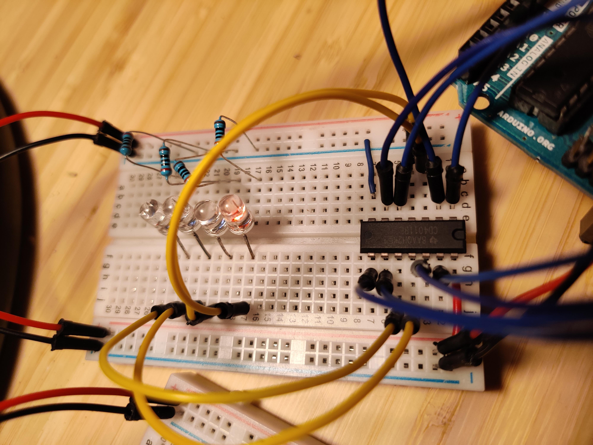

# 4000 Series IC's
  This will serve as documentation and, a quick lookup for myself of 4000 Serices IC's that i've investigated.

## Details
I will be following a similar layout as others

- Description
- Data Sheet Link
- Wiring Table
- Simple Arduino Test Code
- Details
  - image of circuit
  - image of Serial Out
  - other images
- Materials
- Notes

### CD4001 Quad 2 input Nor Gates

- Description - The CD4001 device contain four independent 2-input NOR gates.
- [CD4001 Data Sheet](https://www.ti.com/lit/ds/symlink/cd4001b-mil.pdf)
 
 
- [CD4001 Arduino Code](CD4001/CD4001.ino)
 
  
**Type**|**Arduino Pin**|**IC pin**|**Detail**
-----:|:-----:|:-----:|:-----:
input 1 | 2 | 1 | arduino to IC
input 2 | 3 | 2 | arduino to IC
output 1 | XX | 3 | to LED 1
output 2 | XX | 4 | to LED 2
input 3 | 4 | 5 | arduino to IC
input 4 | 5 | 6 | arduino to IC
Gnd | Gnd | 7 | ardunio GND to IC
input 5 | 6 | 8 | arduino to IC
input 6 | 7 | 9 | arduino to IC
output 3 | XX | 10 | to LED 3
output 4 | XX | 11 | to LED 4
input 7 | 8 | 12 | arduino to IC
input 8 | 9 | 13 | arduino to IC
VCC | 5V | 14 | arduino 5v to IC

### CD4011 Quad 2 input NAND Gates

- Description - The CD4011 device contain four independent 2-input NOR gates.
- [CD4011 Data Sheet](https://www.ti.com/lit/ds/symlink/cd4011b-mil.pdf)
 
- CD4011 Logic Diagram - provides the functions: J = !(A and B), K = !(C and D), L = !(E and F), M = !(G and H)
- [CD4011 Arduino Code](CD4011/CD4011.ino)
 
  
**Type**|**Arduino Pin**|**IC pin**|**Detail**
-----:|:-----:|:-----:|:-----:
input 1 | 2 | 1 | arduino to IC
input 2 | 3 | 2 | arduino to IC
output 1 | XX | 3 | to LED 1
output 2 | XX | 4 | to LED 2
input 3 | 4 | 5 | arduino to IC
input 4 | 5 | 6 | arduino to IC
Gnd | Gnd | 7 | ardunio GND to IC
input 5 | 6 | 8 | arduino to IC
input 6 | 7 | 9 | arduino to IC
output 3 | XX | 10 | to LED 3
output 4 | XX | 11 | to LED 4
input 7 | 8 | 12 | arduino to IC
input 8 | 9 | 13 | arduino to IC
VCC | 5V | 14 | arduino 5v to IC

### CD4017 Decade Counter with 10 Decoded Outputs

- Description - The CD4017 device is a counter containing 10 decoded outputs.  Inputs include Clock, Reset and Clock Inhibit signals.
- [CD4017 Data Sheet](https://www.ti.com/lit/ds/symlink/cd4017b-mil.pdf)
 
 
- [CD4017 Arduino Code](CD4017/CD4017.ino)
 
  
**Type**|**Arduino Pin**|**IC pin**|**Detail**
-----:|:-----:|:-----:|:-----:

## Contributing
Pull requests are welcome. For major changes, please open an issue first to discuss what you would like to change.
